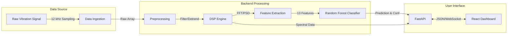

# Vibration Fault Detection System 🏭⚙️

**An Intelligent Predictive Maintenance Solution for Rotating Machinery**

This project is a complete end-to-end system designed to detect and classify faults in industrial bearings using vibration signal analysis and Machine Learning. It simulates a real-world condition monitoring system where vibration data is collected, processed, and analyzed to predict potential failures before they occur.


---

## 📖 Table of Contents

- [System Architecture](#-system-architecture)
- [Key Features](#-key-features)
- [Technical Deep Dive](#-technical-deep-dive)
  - [1. Signal Processing Pipeline](#1-signal-processing-pipeline)
  - [2. Machine Learning Model](#2-machine-learning-model)
  - [3. Backend API](#3-backend-api)
  - [4. Frontend Dashboard](#4-frontend-dashboard)
- [Project Structure](#-project-structure)
- [Setup & Installation](#-setup--installation)
- [API Reference](#-api-reference)

---

## 🏗️ System Architecture

The system follows a modular architecture separating data ingestion, processing, inference, and visualization.



---

## 🚀 Key Features

- **Real-Time Fault Diagnosis:** Instantly classifies machine health into 4 categories: _Normal, Inner Race Fault, Ball Fault, Outer Race Fault_.
- **Advanced Signal Processing:** visualizes raw time-domain signals and Frequency Spectrums (FFT) to identify characteristic fault frequencies.
- **Confidence Scoring:** Provides a probability score (0-100%) for every prediction to gauge reliability.
- **Automated Reporting:** Generates professional PDF diagnostic reports on-demand, including signal plots and statistical summaries.
- **Historical Logging:** Tracks the last 10 diagnostic runs to monitor trends over time.
- **Interactive Dashboard:** A modern, dark-themed UI built with React and Chart.js for high-performance visualization.

---

## 🔬 Technical Deep Dive

### 1. Signal Processing Pipeline (`utils.py`)

Raw industrial vibration data is often noisy. We apply a rigorous DSP pipeline before analysis:

- **Preprocessing:**
  - **Low-Pass Filter:** A 4th-order Butterworth filter (cutoff=0.2) removes high-frequency noise.
  - **Detrending:** Removes linear trends and DC offsets.
  - **Normalization:** Applies Z-score normalization ($\frac{x - \mu}{\sigma}$) to ensure the signal has zero mean and unit variance, matching the training conditions.
- **Feature Extraction (13 Key Indicators):**
  - **Time-Domain:** RMS (Energy), Peak-to-Peak, Crest Factor (Impact severity), Kurtosis (Impulsiveness), Skewness.
  - **Frequency-Domain:** Dominant Frequency, Dominant Amplitude, Spectral Entropy.
  - **Harmonics:** Amplitudes of the first 3 harmonics.
  - **Sidebands:** Energy in sidebands around the dominant frequency.

### 2. Machine Learning Model

- **Algorithm:** Random Forest Classifier (Ensemble Learning).
- **Dataset:** Trained on the **CWRU (Case Western Reserve University) Bearing Data Center** dataset.
- **Input:** A vector of 13 extracted features.
- **Output:** Classification Label + Probability Distribution.
- **Why Random Forest?** It handles non-linear relationships well and is robust against overfitting, making it ideal for tabular feature data derived from signals.

### 3. Backend API (`main.py`)

Built with **FastAPI** for high performance and automatic documentation.

- **Framework:** Python 3.13+, FastAPI, Uvicorn.
- **Libraries:** `scipy` (Signal Processing), `scikit-learn` (Inference), `reportlab` (PDF Generation).
- **Real Data Simulation:** The backend randomly samples segments from real `.mat` files in the `data/` directory to simulate live sensor feeds.

### 4. Frontend Dashboard (`App.jsx`)

Built with **React** and **Vite**.

- **Visualization:** Uses `react-chartjs-2` for rendering real-time line charts.
- **State Management:** React Hooks (`useState`, `useEffect`) manage the WebSocket connection and polling.
- **Styling:** Custom CSS with a "Dark Industrial" theme using `lucide-react` icons.

---

## 📂 Project Structure

```bash
vibration-fault-detection/
├── backend/
│   ├── venv/               # Python Virtual Environment
│   ├── app/
│   │   ├── main.py         # API Entry point & Endpoints
│   │   └── utils.py        # DSP & Feature Extraction Logic
│   └── requirements.txt    # Python Dependencies
├── frontend/
│   ├── src/
│   │   ├── App.jsx         # Main Dashboard Component
│   │   └── App.css         # Dashboard Styling
│   └── package.json        # Node Dependencies
├── data/                   # Raw .mat files (CWRU Dataset)
├── models/                 # Serialized ML Models (.pkl)
├── notebooks/              # Jupyter Notebooks for Analysis
├── scripts/                # Training Scripts
└── README.md               # Project Documentation
```

---

## 🛠 Setup & Installation

### Prerequisites

- **Node.js** (v16 or higher)
- **Python** (v3.8 or higher)

### Step 1: Clone & Prepare

```bash
git clone <repository-url>
cd vibration-fault-detection
```

### Step 2: Backend Setup

```bash
cd backend
python -m venv venv

# Activate Virtual Environment
# Windows:
venv\Scripts\activate
# Mac/Linux: source venv/bin/activate

# Install Python Dependencies
pip install -r requirements.txt
```

### Step 3: Frontend Setup

```bash
cd ../frontend
npm install
```

### Step 4: Run the System

You can run both servers simultaneously from the root directory:

```bash
# From the root 'vibration-fault-detection' folder
npm run dev
```

- **Frontend:** Open [http://localhost:5173](http://localhost:5173)
- **API Docs:** Open [http://127.0.0.1:8000/docs](http://127.0.0.1:8000/docs)

---

## 📡 API Reference

### `POST /predict`

Analyzes a vibration signal segment.

**Request Body:**

```json
{
  "signal": [0.02, 0.04, -0.01, ...],  // Array of float values
  "fs": 12000                          // Sampling Frequency (Hz)
}
```

**Response:**

```json
{
  "prediction": "Inner Race Fault",
  "confidence": 0.98,
  "features": {
    "RMS": 0.15,
    "Kurtosis": 4.2,
    ...
  },
  "fft_freqs": [0, 10, 20, ...],
  "fft_amps": [0.01, 0.5, 0.02, ...]
}
```

### `POST /diagnostic-report`

Generates a PDF report.

**Request Body:** Same as `/predict`.
**Response:** Binary PDF stream (Content-Type: `application/pdf`).

---

## 🤝 Contributing

1.  Fork the repository.
2.  Create a feature branch (`git checkout -b feature/AmazingFeature`).
3.  Commit your changes (`git commit -m 'Add some AmazingFeature'`).
4.  Push to the branch (`git push origin feature/AmazingFeature`).
5.  Open a Pull Request.
